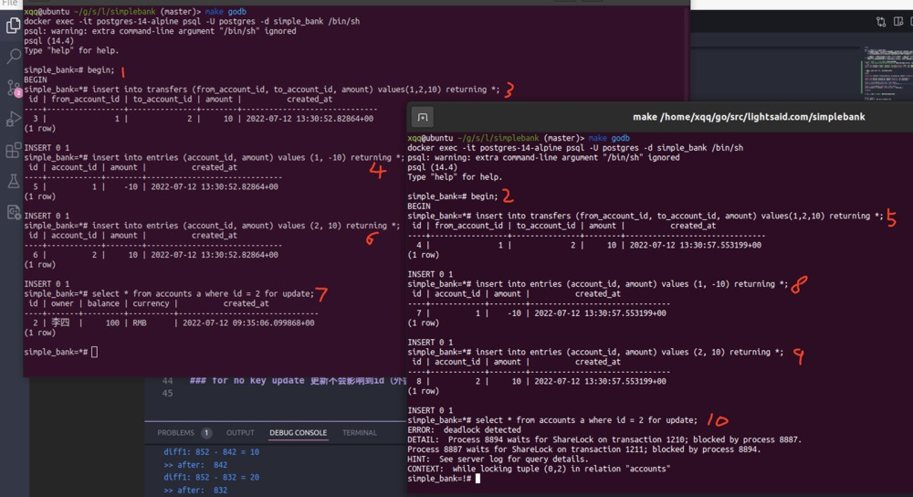
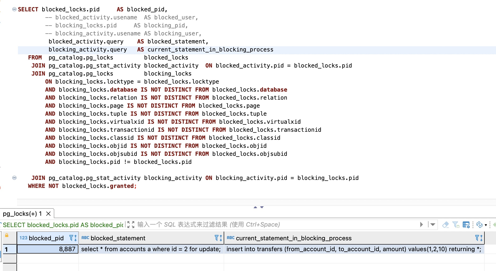
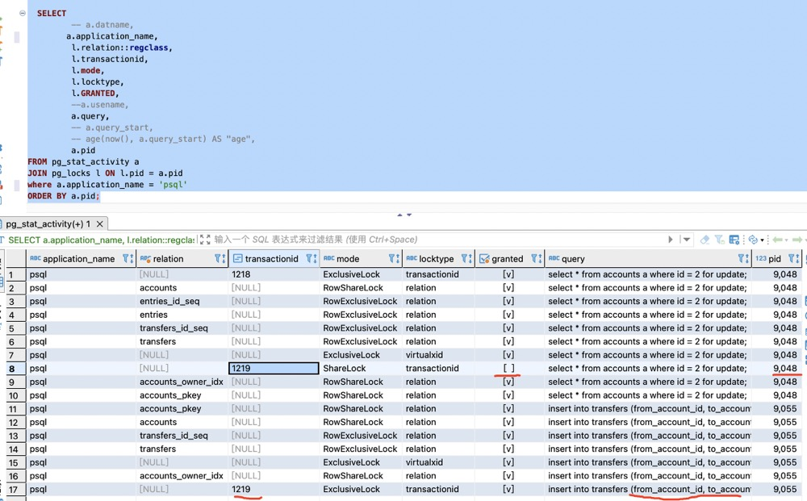
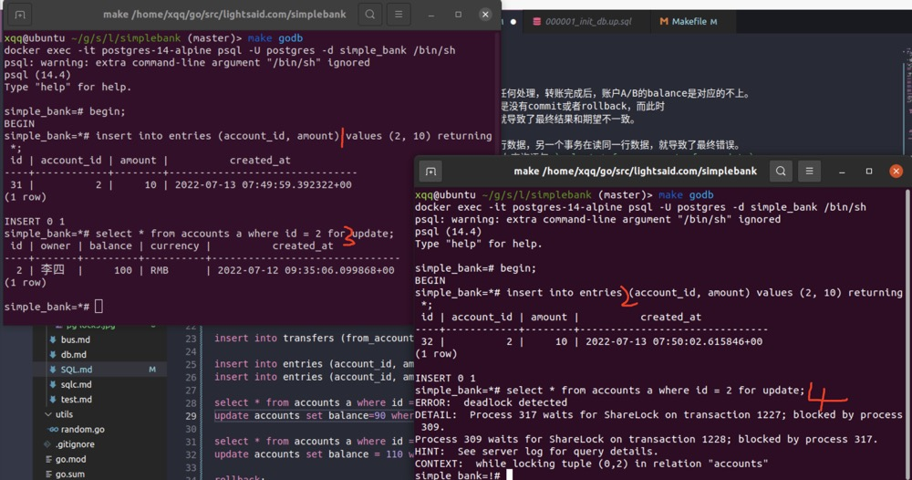

# SQL  

### 在转账交易业务中发生并发问题1
1. 场景：账户A 并发（同时2个或以上）向账户B 转账，如果不作任何处理，转账完成后，账户A/B的balance是对应的不上。
    - 导致这个根源就在于并发时，事务1更新账户A的banlace但是没有commit或者rollback，而此时
    事务2读取了账户A的balance，得到并不是最新的数据了，这就导致了最终结果和期望不一致。

    - 当数据库开启2或2个以上两个事务时，一个事务在更新同一行数据，另一个事务在读同一行数据，就导致了最终错误。
1. 已知道问题所在，解决方案可以使用排他锁：`for update`, 在查询语句 `select * from accounts for update`,
    那么事务2在查询的时候，如果事务1没有commit/rollback, select 语句就会停在那里等待，直到事务1commit/rollback；

1. 使用 `select * ... for update` 就此解决了么？
- 先执行 `make migrate_down && make migrate_up` 重新建表，往accounts添加两条数据
``` sql
insert into accounts ("owner","balance","currency")values ('张三',100,'RMB');
insert into accounts ("owner","balance","currency")values ('李四',100,'RMB');
```

- 下面是转账事务的过程，开两个终端演示并发
```sql
begin;

insert into transfers (from_account_id, to_account_id, amount) values(1,2,10) returning *;

insert into entries (account_id, amount) values (1, -10) returning *;
insert into entries (account_id, amount) values (2, 10) returning *;

select * from accounts a where id = 2 for update;
update accounts set balance=90 where id = 1 returning *;

select * from accounts a where id = 2 for update ;
update accounts set balance = 110 where id = 2 returning *;

rollback;
```
- 两个session执行过程:

- 当执行到上面第7步时候，可分别执行下面两条SQL语句，查看阻塞原因和锁
``` sql
SELECT blocked_locks.pid     AS blocked_pid,
        -- blocked_activity.usename  AS blocked_user,
        -- blocking_locks.pid     AS blocking_pid,
        -- blocking_activity.usename AS blocking_user,
         blocked_activity.query    AS blocked_statement,
         blocking_activity.query   AS current_statement_in_blocking_process
   FROM  pg_catalog.pg_locks         blocked_locks
    JOIN pg_catalog.pg_stat_activity blocked_activity  ON blocked_activity.pid = blocked_locks.pid
    JOIN pg_catalog.pg_locks         blocking_locks 
        ON blocking_locks.locktype = blocked_locks.locktype
        AND blocking_locks.database IS NOT DISTINCT FROM blocked_locks.database
        AND blocking_locks.relation IS NOT DISTINCT FROM blocked_locks.relation
        AND blocking_locks.page IS NOT DISTINCT FROM blocked_locks.page
        AND blocking_locks.tuple IS NOT DISTINCT FROM blocked_locks.tuple
        AND blocking_locks.virtualxid IS NOT DISTINCT FROM blocked_locks.virtualxid
        AND blocking_locks.transactionid IS NOT DISTINCT FROM blocked_locks.transactionid
        AND blocking_locks.classid IS NOT DISTINCT FROM blocked_locks.classid
        AND blocking_locks.objid IS NOT DISTINCT FROM blocked_locks.objid
        AND blocking_locks.objsubid IS NOT DISTINCT FROM blocked_locks.objsubid
        AND blocking_locks.pid != blocked_locks.pid

    JOIN pg_catalog.pg_stat_activity blocking_activity ON blocking_activity.pid = blocking_locks.pid
   WHERE NOT blocked_locks.granted;
  
  -- session1: select * from ... for update 查询被 session2: insert into transfers... 阻塞了，还不是同一表。
  
  
  SELECT 
  		 -- a.datname,
  		a.application_name,
         l.relation::regclass,
         l.transactionid,
         l.mode,
         l.locktype,
         l.GRANTED,
         --a.usename,
         a.query,
         -- a.query_start,
         -- age(now(), a.query_start) AS "age",
         a.pid
FROM pg_stat_activity a
JOIN pg_locks l ON l.pid = a.pid
where a.application_name = 'psql'
ORDER BY a.pid;
```
- 执行结果

- session1: select * from ... for update 查询被 session2: insert into transfers... 阻塞了，还不是同一表; 究竟为什么呢？

- 深入了解，查看执行第二个sql语句结果

如图所示：
    1. pid为9048的事务有一个ShareLock没有被授予，正在执行 `select * from accounts a where id = 2 for update;`
    2. ShareLock锁要被pid为9055的事务授予，正在执行`insert into transfers (from_account_id, to_account_id, amount) values(1,2,10) returning *;`
    3. 为什么会有这个锁呢？因为语句 `select * from accounts a where id = 2 for update;` 中的 `for update`， 任何accounts表字段（同一条数据中）发生变化，都会影响到此条select语句；而`insert into transfers...`中`from_account_id`、`to_account_id`字段是表`accounts`的外键，更重要的是两个事务的两条语句都用到 **acoounts 表 id 都为 2**；因此事务1的`for update语句`以为事务2`insert into` 语句会影响到当前查询 `where id = 2`的结果，所以才有了这个 ShareLock 锁，要的到这个锁的授予必须要等执行 insert into 语句的事务commit或在rollback才能授予；
    所以在图一事务2执行到第10步，就会发生死锁了，此时两个事务同时执行到`select * from accounts a where id = 2 for update;`语句，事务1要等事务2commit/rollback后授予shareLock权限，而事务2又等待事务1commit/rollback...就完犊子了。

    4. 搞清楚了问题所在，拿解决方案是什么？
        1. 第一种方案：修改表，transfers 把外键约束删掉（不推荐）
        2. 第二种方案：使用 `select * ....for no key update` 语句，明确告诉不会改变的主键，因此就会影响到外键（推荐）

#### 再次实践认证
- 抛开转账交易执行的事务，开两个终端执行执行2个事务也会得到同样的结论

- 如图：执行到第3步时，事务1就在等待事务2 commit/rollback 后才能查询结果；此时再执行第4步时，事务2就会死锁了从而rollback了，事务1发现事务2已经rollback，就可以查询了。


#### 总结：for update、for no key update
1. for update 是一种行级锁，又叫排它锁。
2. for no key update 更新不会影响到id（外键）

### 在转账交易业务中发生并发问题2

