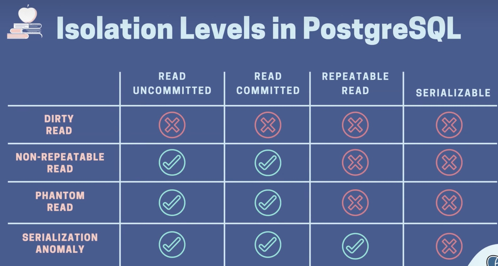

# SQL  

### 在转账交易业务中发生并发问题1
1. 场景：账户A 并发（同时2个或以上）向账户B 转账，如果不作任何处理，转账完成后，账户A/B的balance是对应的不上。
    - 导致这个根源就在于并发时，事务1更新账户A的banlace但是没有commit或者rollback，而此时
    事务2读取了账户A的balance，得到并不是最新的数据了，这就导致了最终结果和期望不一致。

    - 当数据库开启2或2个以上两个事务时，一个事务在更新同一行数据，另一个事务在读同一行数据，就导致了最终错误。
1. 已知道问题所在，解决方案可以使用排他锁：`for update`, 在查询语句 `select * from accounts for update`,
    那么事务2在查询的时候，如果事务1没有commit/rollback, select 语句就会停在那里等待，直到事务1commit/rollback；

1. 使用 `select * ... for update` 就此解决了么？
- 先执行 `make migrate_down && make migrate_up` 重新建表，往accounts添加两条数据
``` sql
insert into accounts ("owner","balance","currency")values ('张三',100,'RMB');
insert into accounts ("owner","balance","currency")values ('李四',100,'RMB');
```

- 下面是转账事务的过程，开两个终端演示并发
```sql
begin;

insert into transfers (from_account_id, to_account_id, amount) values(1,2,10) returning *;

insert into entries (account_id, amount) values (1, -10) returning *;
insert into entries (account_id, amount) values (2, 10) returning *;

select * from accounts a where id = 2 for update;
update accounts set balance=90 where id = 1 returning *;

select * from accounts a where id = 2 for update ;
update accounts set balance = 110 where id = 2 returning *;

rollback;
```
- 两个session执行过程:

- 当执行到上面第7步时候，可分别执行下面两条SQL语句，查看阻塞原因和锁
``` sql
SELECT blocked_locks.pid     AS blocked_pid,
        -- blocked_activity.usename  AS blocked_user,
        -- blocking_locks.pid     AS blocking_pid,
        -- blocking_activity.usename AS blocking_user,
         blocked_activity.query    AS blocked_statement,
         blocking_activity.query   AS current_statement_in_blocking_process
   FROM  pg_catalog.pg_locks         blocked_locks
    JOIN pg_catalog.pg_stat_activity blocked_activity  ON blocked_activity.pid = blocked_locks.pid
    JOIN pg_catalog.pg_locks         blocking_locks 
        ON blocking_locks.locktype = blocked_locks.locktype
        AND blocking_locks.database IS NOT DISTINCT FROM blocked_locks.database
        AND blocking_locks.relation IS NOT DISTINCT FROM blocked_locks.relation
        AND blocking_locks.page IS NOT DISTINCT FROM blocked_locks.page
        AND blocking_locks.tuple IS NOT DISTINCT FROM blocked_locks.tuple
        AND blocking_locks.virtualxid IS NOT DISTINCT FROM blocked_locks.virtualxid
        AND blocking_locks.transactionid IS NOT DISTINCT FROM blocked_locks.transactionid
        AND blocking_locks.classid IS NOT DISTINCT FROM blocked_locks.classid
        AND blocking_locks.objid IS NOT DISTINCT FROM blocked_locks.objid
        AND blocking_locks.objsubid IS NOT DISTINCT FROM blocked_locks.objsubid
        AND blocking_locks.pid != blocked_locks.pid

    JOIN pg_catalog.pg_stat_activity blocking_activity ON blocking_activity.pid = blocking_locks.pid
   WHERE NOT blocked_locks.granted;
  
  -- session1: select * from ... for update 查询被 session2: insert into transfers... 阻塞了，还不是同一表。
  
  
  SELECT 
  		 -- a.datname,
  		a.application_name,
         l.relation::regclass,
         l.transactionid,
         l.mode,
         l.locktype,
         l.GRANTED,
         --a.usename,
         a.query,
         -- a.query_start,
         -- age(now(), a.query_start) AS "age",
         a.pid
FROM pg_stat_activity a
JOIN pg_locks l ON l.pid = a.pid
where a.application_name = 'psql'
ORDER BY a.pid;
```
- 执行结果

- session1: select * from ... for update 查询被 session2: insert into transfers... 阻塞了，还不是同一表; 究竟为什么呢？

- 深入了解，查看执行第二个sql语句结果

如图所示：
    1. pid为9048的事务有一个ShareLock没有被授予，正在执行 `select * from accounts a where id = 2 for update;`
    2. ShareLock锁要被pid为9055的事务授予，正在执行`insert into transfers (from_account_id, to_account_id, amount) values(1,2,10) returning *;`
    3. 为什么会有这个锁呢？因为语句 `select * from accounts a where id = 2 for update;` 中的 `for update`， 任何accounts表字段（同一条数据中）发生变化，都会影响到此条select语句；而`insert into transfers...`中`from_account_id`、`to_account_id`字段是表`accounts`的外键，更重要的是两个事务的两条语句都用到 **acoounts 表 id 都为 2**；因此事务1的`for update语句`以为事务2`insert into` 语句会影响到当前查询 `where id = 2`的结果，所以才有了这个 ShareLock 锁，要的到这个锁的授予必须要等执行 insert into 语句的事务commit或在rollback才能授予；
    所以在图一事务2执行到第10步，就会发生死锁了，此时两个事务同时执行到`select * from accounts a where id = 2 for update;`语句，事务1要等事务2commit/rollback后授予shareLock权限，而事务2又等待事务1commit/rollback...就完犊子了。

    4. 搞清楚了问题所在，拿解决方案是什么？
        1. 第一种方案：修改表，transfers 把外键约束删掉（不推荐）
        2. 第二种方案：使用 `select * ....for no key update` 语句，明确告诉不会改变的主键，因此就会影响到外键（推荐）

#### 再次实践认证
- 抛开转账交易执行的事务，开两个终端执行执行2个事务也会得到同样的结论

- 如图：执行到第3步时，事务1就在等待事务2 commit/rollback 后才能查询结果；此时再执行第4步时，事务2就会死锁了从而rollback了，事务1发现事务2已经rollback，就可以查询了。

#### 最好的方式是避免使用锁，不用锁就不会有死锁
最好的方式，如果能避免死用锁，就不用锁；
上面解决转账并发的方式，是查询select accounts再update accounts，才使用了 for update 锁；
其实可以使用下面SQL语句，避免使用 for update，而且只有一条语句。
`update accounts set balance = balance + 10 where id = 1 returning *;`

-- 因此最终解决方式选用此种方式。


#### 总结：for update、for no key update
1. for update 是一种行级锁，又叫排它锁。
2. for no key update 更新不会影响到id（外键）

### 在转账交易业务中发生并发问题2
**上面已经解决由外键引起的死锁问题，而且并发的都是又A账户向B账户转账，如果同时存在A转B，B转A并发会发生什么呢？**
- 模拟A转B，B转A 事务, 开启两个终端同时启动事务
``` sql
-- Tx1: transfer $10 form account 1 to account 2
begin;
update accounts set balance = balance - 10 where id = 1 returning *;  -- 第1步
update accounts set balance = balance + 10 where id = 2 returning *;  -- 第3步
rollback;

-- Tx2: transfer $10 form account 2 to account 1
begin;
update accounts set balance = balance - 10 where id = 2 returning *;  -- 第2步
update accounts set balance = balance + 10 where id = 1 returning *;  -- 第4步
rollback;
```
*事务1上面执行到第`3`步时，就在等待了，因为事务2执行了第二步，两个事务同时修改accounts表中同一条数据了，事务1是第二修改到accounts表id为2的数据，所以事务1需要等待事务2提交或回滚事务才能继续往下执行；如果在执行第4步，两个事务有同时修改accouts表id为1的数据了，而这次是事务1先修改数据，事务2要等待事务1提交或回滚；因此有进入了死锁。*

- 知道了原因，那有什么解决方案呢？直观的方式，就是一开始就让事务2等待事务1执行完了（commit/rollback）后再执行，将上面第`2`和第`4`步对换，即可解决，这样作的目的就是让两个事务一开是就对就对同一条数据操作（account表id为1的数据），后开始事务就必须要前事务执行完才开始执行了。
- 核心代码
``` go
// 更新 balance 同时解决双向转账并发问题，有序执行
if arg.FromAccountID < arg.ToAccountID {
    if result.FromAccount, err = updateMoney(ctx, q, arg.FromAccountID, -arg.Amount); err != nil {
        return err
    }
    if result.ToAccount, err = updateMoney(ctx, q, arg.ToAccountID, arg.Amount); err != nil {
        return err
    }
} else {
    if result.ToAccount, err = updateMoney(ctx, q, arg.ToAccountID, arg.Amount); err != nil {
        return err
    }
    if result.FromAccount, err = updateMoney(ctx, q, arg.FromAccountID, -arg.Amount); err != nil {
        return err
    }
}

func updateMoney(ctx context.Context, q *Queries, accountID, amount int64) (Account, error) {
	param := AddAccountBalanceParams{
		Amount: amount,
		ID:     accountID,
	}
	return q.AddAccountBalance(context.Background(), param)
}

```

### MySQL、PostgreSQL 事务隔离级别
**ACID 属性分别是指：原子性、一致性、隔离性、持久性**
- Read Phenomena(读取现象) 如果不考虑隔离性，可能会引发以下现象
    1. dirty read （脏读）
        * 当一个事务读取其他并发事务写入的数据时发生，并发事务尚未commit/rollback

    1. non-repeatable read （不可重复读）
        * 当一个事务两次读取同一行记录并看到不同值时，因为该行已被其他事务修改了，并在第一次读取后提交了。
  
    1. phantom read （幻读）
        * 幻读类似不可重复读，但是幻读影响的时多行而不是一行。在这种情况下，重新执行相同的查询，返回一组不同行，由于其他事务最近提交的事务做的一些更改，比如插入新的行或者删除了现有的行，刚好满足当前查询条件。
   
    1. serialization anomaly (序列化异常/串行化异常)
        * 当一组并发事务的结果无法实现时，如果尝试以任何顺序依次运行它们而不相互重叠。

- 4个标准的事务隔离级别（由底到高）
    1. read uncommitted（读未提交）
        * 允许脏读发生
    1. read committed（读已提交）
        * 事务自能读取其他事务已提交的数据，不会存在脏读想象。
    1. repeatable read（可重复读）
        * 它确保相同的条件查询将始终返回相同的结果，无论执行多少次，即使其他并发事务提交了满足查询的新更改，都返回相同结果。
    1. serializable (可序列化/可串行化)
        * 在此级别允许的并发事务保证能够产生相同的结果，就好像它们以某种顺序依次执行，一个接一个，没有重叠。
    *以上由底到高有四种事务隔离级别，因此至少存在一种方式解决这些并发事务，即使是默认。*


#### 探讨 MySQL 四事务隔离级别和对应的读取现象
*创建一个accounts表，并插入三条数据*
``` sql
CREATE TABLE `accounts` (
  `id` int unsigned PRIMARY KEY AUTO_INCREMENT,
  `owner` varchar(10) NOT NULL,
  `balance` bigint NOT NULL,
  `currency` varchar(10) NOT NULL,
  `created_at` timestamp NOT NULL DEFAULT now()
);

INSERT into 
	accounts (owner, balance, currency) 
values
	('one', 100, 'RMB'),
	('two', 100, 'RMB'),
	('three', 100, 'RMB');
	
SELECT * from accounts a ;
```
**1. 读未提交** <br/>
- 这种相对简单，比如两个并发事务，事务2读取了事务1修改并没提交的数据，如果事务1回滚了，事务2就发生脏读了。

**2. 读已提交** <br/>
- 如图所示：事务1修改了balance未commit，事务2读取不到，因此'读已提交'能防止脏读。


- 不可重复读和幻读现象究竟如何？如下图：(不可重复读和幻读很像，一行和多行之差)

*在事务1更新balance提交后，事务2前后两次同条件（where id = 1）查询得到一行数据不同的结果，这就是`不可重复读`* <br/>
*在事务1更新balance提交后，事务2前后两次同条件（where balance >= 90）查询结果得到不一样的行数，这就幻读* <br/>

- 因此 `读已提交`隔离级别 只能解决脏读问题，仍然允许不可重复读和幻读。
**

**3. 可重复读** <br/>
- 如图所示: 将事务隔离等级设置为可重复读后，虽然解决了不可重复读、幻读问题；但是出现了令人意外的一幕，
事务2在执行 update 语句时，读取balance时事务1提交后的值，查询的时80，update时却是70；
不知到MySQL因为什么会选择种方式实现可重复读隔离级别。此时的update抛出异常可能更合理。

- *这种情况在PostgreSQL中，会抛出异常。*


- 总结：MySQL 中可重复读 隔离级别虽然解决了不可重复读和幻读问题，但是要注意更新问题。

**4. 可序列化** <br/>
如图:

- 当事务1执行到第3步时被事务2的第2步阻塞了，为什么呢？
    - 因为在可序列化隔离级别下，MySQL将普通的select语句转换成`select for share`，
    仅支持其他事务读取行，不允许更新或删除它门。
    - 可序列化隔离级别下，`select for share` 有了锁机制，此时锁有超时问题，因此超时需要重试（编码时需要处理）
    - 有了锁，就会出现死锁的可能，当同时在两个事务里更新同一行数据时，就会死锁（这个在编码的时候也需要处理）
    

-----------------------
- MySQL一些与事务隔离相关SQL语句
* 查询当前会话的事务隔离级别 `select @@transaction_isolation;` 默认是 "REPEATABLE-READ"（可重复读）；
* 查询全局的事务隔离级别 `select @@global.transaction_isolation;` 默认是 "REPEATABLE-READ"（可重复读）；
* 设置会话的事务级别 `set session transaction isolation level read uncommitted;`
    

### PostgreSQL 事务隔离级别和对应的读取现象
- 查看当前事务隔离级别 `show transaction isolation level;` （默认 read committed）
- 设置事务隔离级别 `set transaction isolation level repeatable read;`

**1. 读未提交和读已提交** <br/>
- PostgreSQL 事务隔离级别`默认是->读已提交`， 即使设置了`读未提交`,依旧是按照读已提交方式处理；
这是 PostgreSQL 读已提交 和 读未提交 的实现方式。因此可以说postgresql只有三种事务隔离级别。
- 其次 PostgreSQL 读已提交 事务隔离级别和 MySQL 一致。

**2. 可重复读** <br/>
- PostgreSQL 可重复读事务隔离级别和 MySQL 基本一直，就是在更新同一行数据时，后面更新事务会抛出异常。
- 可重复读会出现序列化异常，如图：（两个事务insert相同的数据）


**3. 可序列化** <br/>
如图: (由于事务之间的读/写依赖性，无法序列化访问，因此并发的时候不会重复创建记录。)


MySQL在序列化隔离级别是通过锁的机制实现序列化正确，从而不创建重复记录。当事务并发的时候，一个事务新增了一条记录，另一个事务查询是被阻止的，直到第一个事务commit/rollback；

- MySQL 和 PostgreSQL 事务隔离和读取现象对比表。
----
1. MySQL


2. PostgreSQL


#### 最后使用事务隔离，要注意的问题
- 可能会出现一些错误，超时甚至死锁，因此需要在代码里实施重试机制。
